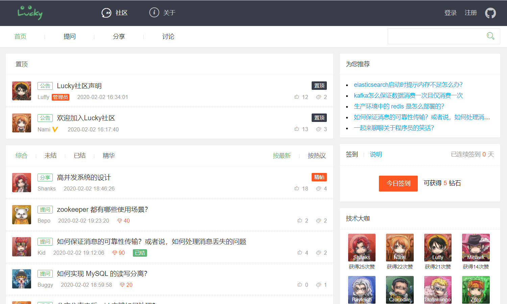
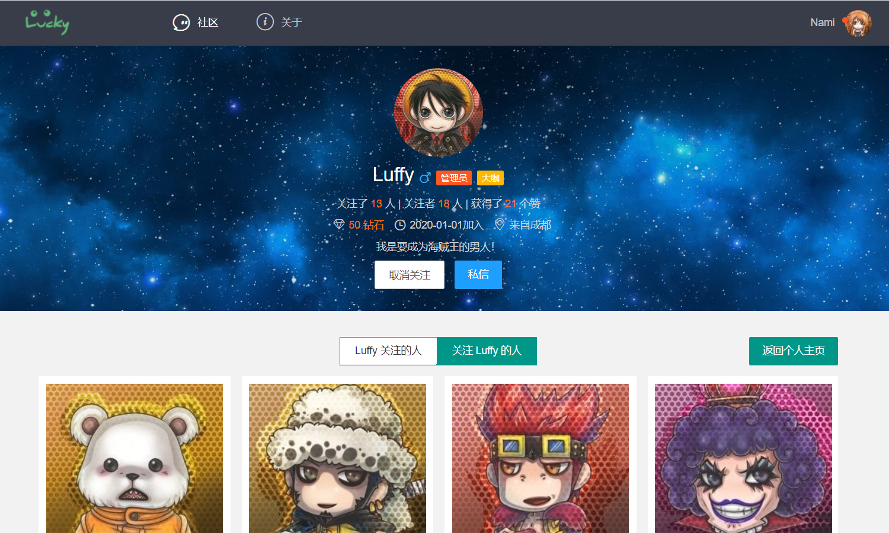
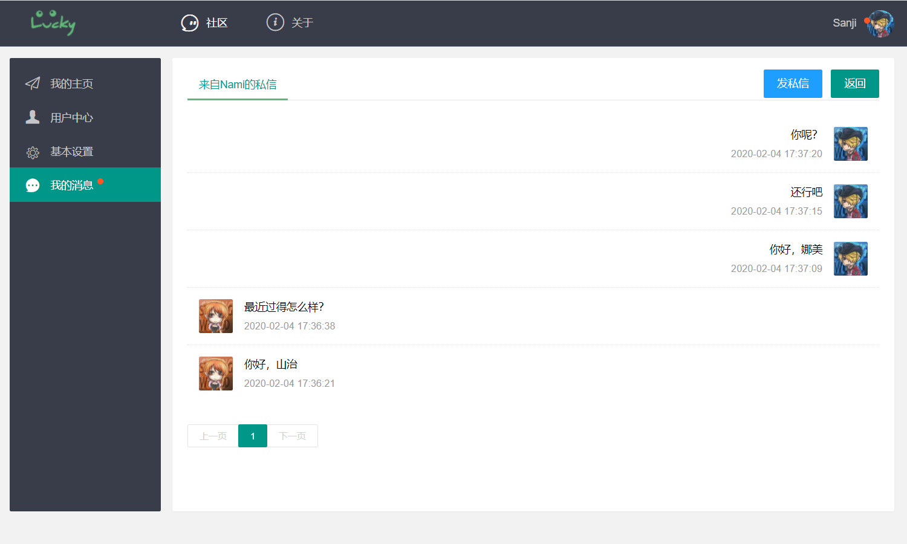
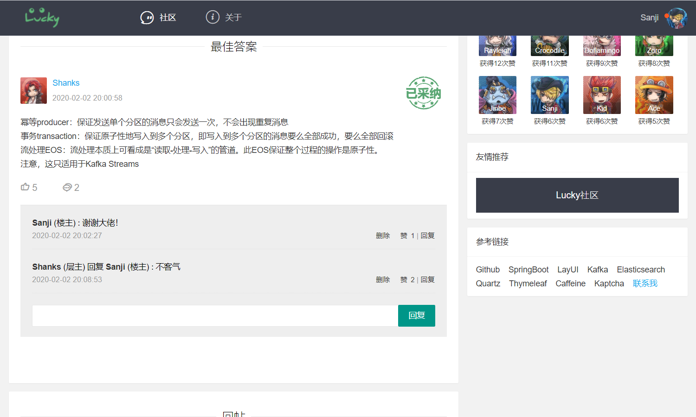

 

Lucky社区 - 自由的问答社区

- 基于 `Spring Boot` 开发的一款问答型 `BBS`
- 如果觉得不错 给个 `Star` 支持一下 🤓

## 在线地址
- [Lucky社区](http://www.luckybugq.cn)
## 技术栈
- SpringBoot 核心框架  
- MyBatis 数据访问层  
- ThymeLeaf 模板引擎
- LayUI 前端UI框架
- MySQL 关系型数据库
- Redis 非关系型数据库
- Kafka 消息队列
- Elasticsearch 分布式搜索引擎
## 功能介绍
- 签到：记录用户->签到信息/连续签到天数
- 点赞：记录用户->帖子/评论的点赞信息
- 关注：记录用户->关注/被关注（仿新浪微博）
- 私信：记录用户->用户私信（仿百度贴吧）
- 交易：记录用户->钻石进行问答交易（仿百度知道）
- 验证码：Kaptcha生成工具实现机器验证
- 邮件验证：通过邮件激活账号和找回密码
- 游客登录：自动创建游客账号并进行权限限制
- 登录检查：Cookie和Redis中登录凭证的核验
- 提问回答：钻石悬赏、问题采纳、最佳答案置顶等（仿百度知道）
- 帖子分类：帖子多级分类，实现快速筛选
- 文本解析：实现表情、链接、图片等功能的富文本解析器
- 多级评论：数据库表单和前端设计（仿百度贴吧）
- 异步设计：Kafka实现帖子发布等模块的异步处理
- 系统通知：站内评论/点赞/关注通知的异步推送
- 权限管理：Spring Security实现权限控制（管理员、版主、用户）
- 全文搜索：Elasticsearch构建分布式全文搜索引擎
- 热度排行：Quartz配置帖子热度分数定时刷新
- 热点缓存：Caffeine本地缓存热点信息
- 多级缓存：本地缓存->Redis->MySQL多级缓存
- 对象存储：阿里云OSS实现图片上传到云
- 长图分享：wkhtmltoimage插件实现网页长图分享
- 数据记录：Redis高级数据类型记录独立IP访问数量和日活跃用户
- 敏感词过滤：前缀树算法进行帖子的库内敏感词替换
- 第三方登录：Github OAuth2授权快速注册/登录
## 本地部署
- 修改配置文件application.properties
- 启动MySQL、Redis、Kafka、Elasticsearch
- 导入sql文件下的lucky-community.sql脚本
- 启动项目
- 浏览器访问：http://localhost:8080
## 目录结构
<pre><code>├─community              应用目录
│  ├─actuator            监控器
│  ├─annotation          注释声明
│  ├─aspect              方面声明
│  ├─config              配置类
│  ├─controller          控制器
│  │  ├─advice           异常处理
│  │  ├─interceptor      拦截器
│  ├─dao                 数据访问层
│  ├─entity              实体类
│  ├─event               消息队列类
│  ├─quartz              定时任务类
│  ├─service             业务逻辑层
│__├─util                工具类
</code></pre>
## 图片演示

